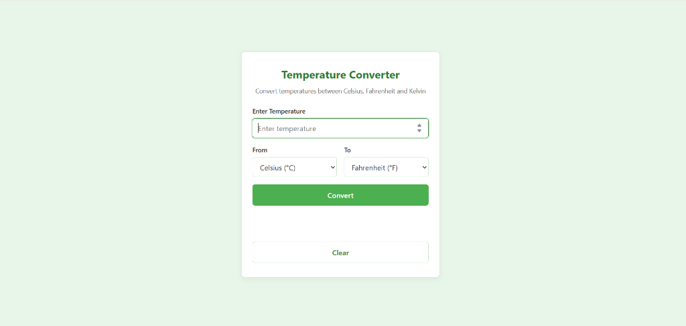
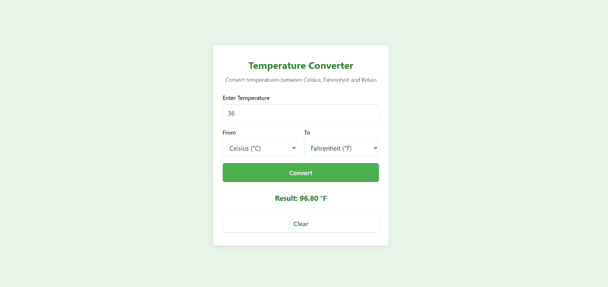

# SCT_SD_1: Temperature Converter

A lightweight, accessible, and responsive Temperature Converter web application.

---

## 📌 Description

This application converts temperature values between **Celsius (°C)**, **Fahrenheit (°F)**, and **Kelvin (K)**. It features strict physical validation (such as enforcing absolute zero limits), clear user feedback, and a clean, student-crafted light-green visual theme.

---

## ✨ Features

- **Multi-Unit Conversions**: Supports all 6 unit conversion combinations plus same-unit passthrough.
- **Physical Validation**: Rejects temperatures below absolute zero for Celsius (-273.15°C), Fahrenheit (-459.67°F), and Kelvin (0 K).
- **Input Error Handling**: Catches empty inputs and non-numeric characters with user-friendly error messages.
- **Formatted Results**: Displays all outputs rounded cleanly to 2 decimal places with proper unit symbols (`°C`, `°F`, `K`).
- **Clear Form Functionality**: Instantly resets inputs, dropdown selections, error messages, and restores focus to the input field.
- **Responsive Layout**: Designed for mobile and desktop screens using modern CSS Flexbox and media queries.
- **Keyboard Friendly**: Trigger conversions seamlessly using the `Enter` key.
- **Accessible Design**: Features accessible `<label>` associations and `aria-live="polite"` region for screen reader announcements.

---

## 🛠️ Technologies Used

- **HTML5**: Semantic document structure and accessible form elements.
- **CSS3**: Hand-written styling using CSS Custom Properties (`:root`), Flexbox layout, and media queries (no external frameworks).
- **Vanilla JavaScript (ES6)**: Clean, modular, well-commented functions without any third-party libraries or build tools.

---

## 📐 Conversion Formulas

| Conversion | Formula |
|---|---|
| **Celsius → Fahrenheit** | `F = (C × 9/5) + 32` |
| **Fahrenheit → Celsius** | `C = (F − 32) × 5/9` |
| **Celsius → Kelvin** | `K = C + 273.15` |
| **Kelvin → Celsius** | `C = K − 273.15` |
| **Fahrenheit → Kelvin** | `K = (F − 32) × 5/9 + 273.15` |
| **Kelvin → Fahrenheit** | `F = (K − 273.15) × 9/5 + 32` |

*Same-unit conversions return the entered value formatted to 2 decimal places.*

---

## 🚀 How to Run

Because this project uses vanilla technologies with no build steps or dependencies:

1. Clone or download this repository.
2. Open `SCT_SD_1.html` directly in any web browser (Double-click `SCT_SD_1.html` or drag it into your browser).
3. *(Optional)* Alternatively, serve locally using a local development server such as VS Code Live Server or Python:
   ```bash
   python -m http.server 8000
   ```
   Then navigate to `http://localhost:8000` in your web browser.

---

## 📁 Project Structure

```text
SCT_SD_1/
│
├── SCT_SD_1.html    # Application HTML structure
├── SCT_SD_1.css     # Custom CSS styles & color palette
├── SCT_SD_1.js      # JavaScript validation & conversion logic
├── img1.png         # Initial interface screenshot
├── img2.png         # Conversion result screenshot
├── README.md        # Project documentation
└── .gitignore       # Git ignore rules for system files
```

---

## 🖼️ Screenshots

### Initial Application State


### Conversion Result State


---

## 📄 License

This project is licensed under the [MIT License](LICENSE).
